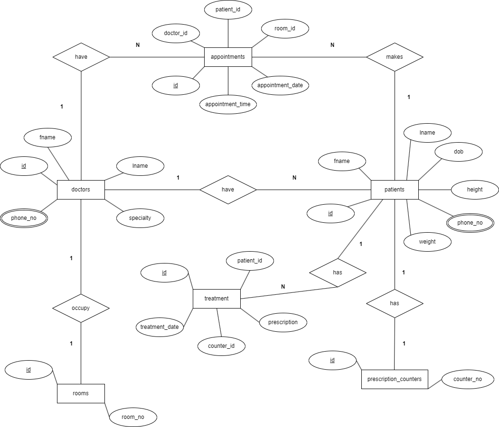

# Hospital Management Database Script

## Problem Statement

The goal of this project is to create and manage a hospital database using Oracle SQL to support a range of healthcare operations, including managing doctors, patients, appointments, treatments, and rooms. The solution is designed to handle basic CRUD operations (Create, Read, Update, Delete), perform joins to retrieve related data from multiple tables, and implement transactions, security controls, and data integrity constraints.

## Conceptual Diagram

The conceptual diagram for this project is a relational database model where tables such as doctors, patients, rooms, appointments, prescription_counters, and treatment are interconnected.



## Description of SQL Operations

### Data Definition Language (DDL):

DDL (Data Definition Language) is used to define and manage database objects such as tables.

Tables are created using CREATE TABLE, and Primary Keys and Foreign Keys are defined to enforce data integrity e.g.

```sql
CREATE TABLE doctors (
    id NUMBER GENERATED BY DEFAULT AS IDENTITY PRIMARY KEY,
    fname VARCHAR2(20) NOT NULL,
    lname VARCHAR2(20) NOT NULL,
    speciality VARCHAR2(20) NOT NULL,
    phone_no CHAR(10) NOT NULL
);
```

### Data Manipulation Language (DML):

DML (Data Manipulation Language) is used to manage data in the tables (e.g., insert, update, delete).

The script inserts sample data into the tables using INSERT INTO.


Updates records in the patients table and deletes records from appointments and patients using UPDATE and DELETE.

Example Update Query:

```sql
UPDATE patients
SET height = 1.76
WHERE id = 1;
```

<!-- Figure 3: Updating Patient Height -->

Example Delete Query:

```sql
DELETE FROM appointments WHERE id = 5;
```

#### Joins:

Joins are used to retrieve related data across tables, such as retrieving doctor and patient details for specific appointments.

Example Join Query:
SELECT
p.fname || ' ' || p.lname AS patient_name,
d.fname || ' ' || d.lname AS doctor_name,
d.speciality AS specialty,
r.room_no AS room_number,
a.appointment_date,
a.appointment_time
FROM appointments a
JOIN patients p ON a.patient_id = p.id
JOIN doctors d ON a.doctor_id = d.id
JOIN rooms r ON a.room_id = r.id;

<!-- Figure 4: Retrieving Appointment Details Using Joins -->

#### Subqueries:

Subqueries are used to fetch specific data, such as finding patients older than 30 years.

Example Subquery:
SELECT fname, lname, dob
FROM patients
WHERE dob < (SELECT ADD_MONTHS(SYSDATE, -12\*30) FROM dual); -- Patients older than 30 years

<!-- Figure 5: Subquery to Find Patients Older than 30 Years -->

### Data Control Language (DCL):

DCL (Data Control Language) is used to grant and revoke access privileges to users.

GRANT and REVOKE commands are used to manage user privileges on the tables.

Example:
GRANT SELECT, INSERT, UPDATE, DELETE ON appointments TO user1;

<!-- Figure 6: Granting Permissions to User -->

### Transaction Control Language (TCL):

TCL (Transaction Control Language) is used to manage database transactions (e.g., commit, rollback).

The script includes COMMIT to save changes and ROLLBACK to undo changes if needed.

Example:
COMMIT; -- To save changes
ROLLBACK; -- To undo changes
