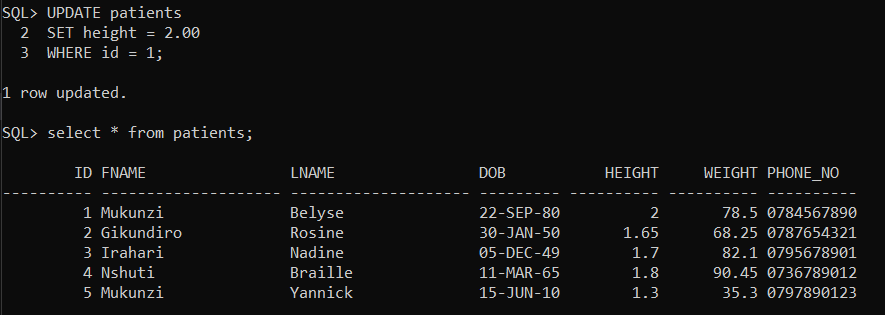

# Hospital Management Database Script

## Problem Statement

The goal of this project is to create and manage a hospital database using Oracle SQL to support a range of healthcare operations, including managing doctors, patients, appointments, treatments, and rooms. The solution is designed to handle basic CRUD operations (Create, Read, Update, Delete), perform joins to retrieve related data from multiple tables, and implement transactions, security controls, and data integrity constraints.

## Conceptual Diagram

The hospital database is structured as a relational database model where multiple entities (doctors, patients, rooms, appointments, prescription counters, and treatments) are interconnected through relationships such as one-to-one, one-to-many and many-to-one.


## Description of SQL Operations

### Data Definition Language (DDL):

DDL (Data Definition Language) is used to define and manage database objects such as tables.

Tables are created using CREATE TABLE, and Primary Keys and Foreign Keys are defined to enforce data integrity. Below is the query used to create the doctors table.

```sql
CREATE TABLE doctors (
    id NUMBER GENERATED BY DEFAULT AS IDENTITY PRIMARY KEY,
    fname VARCHAR2(20) NOT NULL,
    lname VARCHAR2(20) NOT NULL,
    speciality VARCHAR2(20) NOT NULL,
    phone_no CHAR(10) NOT NULL
);
```

### Data Manipulation Language (DML):

DML (Data Manipulation Language) is used to manage data in the tables (e.g., insert, update, delete).

The script **inserts** sample data into the tables using INSERT INTO.


**Updates** records in the patients table using UPDATE.



**Deletes** records from appointments using DELETE.


#### Joins:

Joins are used to retrieve related data across tables. The screenshot below shows how a join can be used to retrieve doctor and patient details for specific appointments.


#### Subqueries:

Subqueries are used to fetch specific data. The subquery below only returns patients older than 30 years.


### Data Control Language (DCL):

DCL (Data Control Language) is used to grant and revoke access privileges to users.

GRANT command is used to manage user privileges on the tables. In the screenshot below, the user is granted all privileges. This allows the user to perform any action on the database, including creating, modifying, and deleting objects.


### Transaction Control Language (TCL):

TCL (Transaction Control Language) is used to manage database transactions (e.g., commit, rollback).

The script includes COMMIT to save changes and ROLLBACK to undo changes if needed.

```sql
COMMIT; -- To save changes

ROLLBACK; -- To undo changes
```
